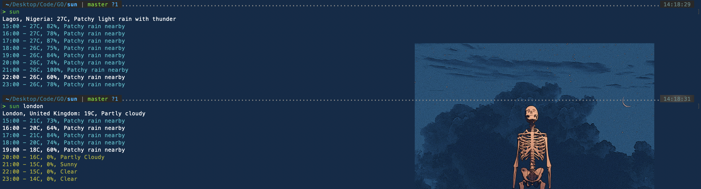

# Sun

A CLI weather tool built with golang

## Installation

To install this tool and make the `sun` command available globally, run:

`go get -u github.com/somtojf/sun`

## Usage

To use this tool run:
`sun -l <location>` to get the weather information for the specified location
